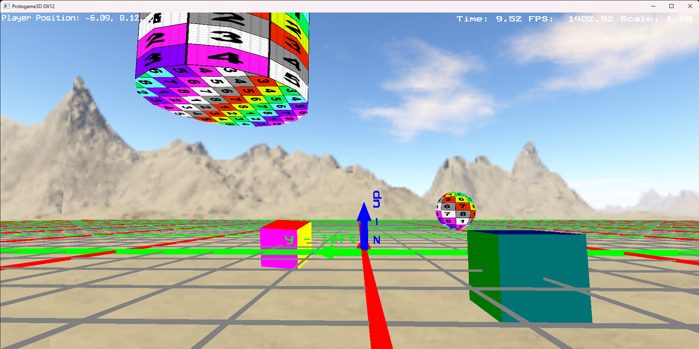

# Protogame3D
It is a 3D Game Template Project.   
Please check the ReadMe file of [CloudEngine](https://github.com/cloud-sail/CloudEngine) to make a new project from this project.

## Gallery
> Demo  
> 


## Controls
```
Mouse and KeyBoard:
Mouse  - Aim
W / S  - Move
A / D  - Strafe
Q / E  - Elevate
Z / C  - Roll
Shift  - Sprint
H      - Reset Camera
1      - Spawn Line
2      - Spawn Point
3      - Spawn Wireframe Sphere
4      - Spawn Basis
5      - Spawn Billboarded Text
6      - Spawn Wireframe Cylinder
7      - Add Message
~      - Open Dev Console
Escape - Exit Game
Space  - Start Game

GamePad:
Right Stick  - Aim
Left Stick   - Move
L/R Trigger  - Roll
L/R Shoulder - Elevate
A            - Sprint
Start        - Reset Camera
```
